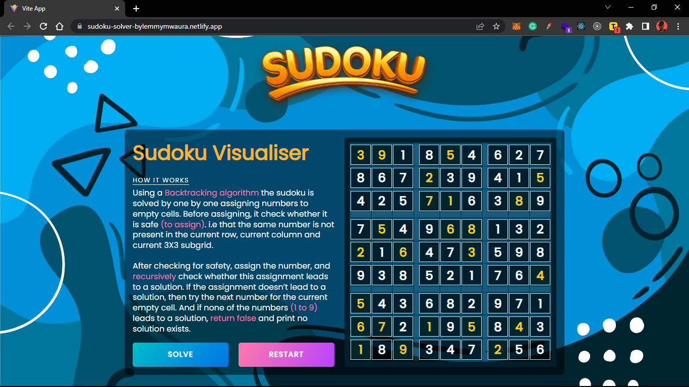

# Sudoku Solver Visualizer
Sudoku Solver Visualizer. A Sudoku solver implemented using a backtracking algorithm. (visualises the backtracking)

---
___

### Screenshot

___
---
### Introduction
Sudoku Solver Visualizer.

Using a Backtracking algorithm the sudoku is solved by one by one assigning numbers to empty cells. Before assigning, it check whether it is safe (to assign). i.e that the same number is not present in the current row, current column and current 3X3 subgrid.

After checking for safety, assign the number, and recursively check whether this assignment leads to a solution. If the assignment doesn’t lead to a solution, then try the next number for the current empty cell. And if none of the numbers (1 to 9) leads to a solution, return false and print no solution exists.

---
___
### Built with / Technologies Used

- React

---
___

# Getting Started

First clone the repository from Github and switch to the new directory:

    $ git clone git@github.com:LemmyMwaura/Sudoku-Solver-Visualizer.git
    $ cd Sudoku-Solver-Visualizer

Run the Project

    $ npm run dev

---
___

## License and Copywright Information
(c) Stephen Lemmy Mwaura, Software Engineer.

Licensed under the [MIT License](LISENCE)

---
___
